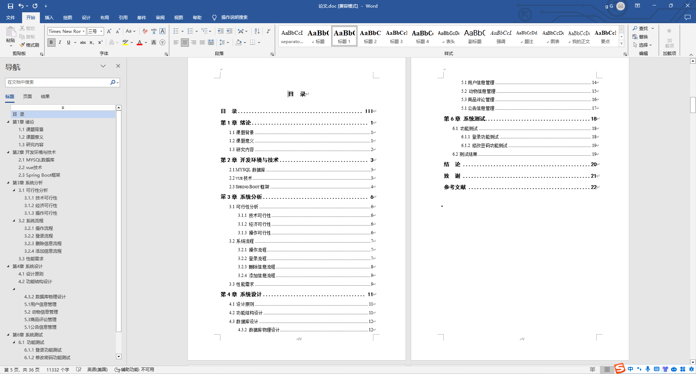

基于SpringBoot的流浪动物救助网站（程序+论文）
=
- 完整代码获取地址：从戎源码网 ([https://armycodes.com/](https://armycodes.com/))
- 作者微信：19941326836  QQ：952045282 
- 承接计算机毕业设计、Java毕业设计、Python毕业设计、深度学习、机器学习
- 选题+开题报告+任务书+程序定制+安装调试+论文+答辩ppt 一条龙服务
- 所有选题地址https://github.com/nature924/allProject

一、项目介绍
---
基于Spring Boot框架实现的流浪动物救助网站，系统包含两种角色：管理员、用户,系统分为前台和后台两大模块，主要功能如下。

### 前台：
- 动物领养/捐赠：用户可以浏览和申请领养/捐赠流浪动物。
- 论坛：用户可以在论坛中交流关于流浪动物救助的经验和信息。
- 公告信息：发布流浪动物救助相关的公告信息。
- 商品：展示和购买与流浪动物有关的商品。
- 寻宠请求：用户可以发布寻找走失宠物的请求。
- 个人中心：管理个人信息和相关操作。
- 购物车：用户可以将感兴趣的商品加入购物车进行批量购买。

### 后台：
- 用户：
  - 个人中心：管理个人信息。
  - 动物领养/捐赠管理：处理用户提交的动物领养/捐赠申请。
  - 动物领养审核管理：审核和管理动物领养申请。
  - 论坛管理：管理论坛中的帖子和评论。
  - 公告信息管理：发布和管理公告信息。
  - 商品管理：管理平台上的商品信息和库存。
  - 寻宠请求管理：处理用户发布的寻宠请求。

- 管理员：
  - 管理员管理：管理管理员账号和权限。
  - 动物领养审核管理：审核和管理动物领养申请。
  - 基础数据管理：管理系统的基础数据，如动物种类、品种等。
  - 论坛管理：管理论坛中的帖子和评论。
  - 公告信息管理：发布和管理公告信息。
  - 商品管理：管理平台上的商品信息和库存。
  - 寻宠请求管理：处理用户发布的寻宠请求。
  - 用户管理：管理用户的信息和权限。

二、项目技术
---
- 编程语言：Java
- 数据库：MySQL
- 项目管理工具：Maven
- 前端技术：VUE、HTML、Jquery、Bootstrap
- 后端技术：Spring、SpringMVC、MyBatis

三、运行环境
---
- 操作系统：Windows、macOS都可以
- JDK版本：JDK1.8以上都可以
- 开发工具：IDEA、Ecplise、Myecplise都可以
- 数据库: MySQL5.7以上都可以
- Tomcat：任意版本都可以
- Maven：任意版本都可以

四、运行截图
---
### 论文截图：

### 程序截图：

